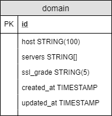

# Domainf #
Simple page that get the information of a server and knows if its configuration has changed.

## Model
Domainf model is a single table called domain that store the necessary information to validate 
if the domain change or not. 



## API ##
### Servers ###
```
GET http://localhost:8546/servers
```
#### Description ####
Return the server information of a specific domain

#### Parameters ####
| Type          | Name          | Description           |
| ------------- |:-------------:|:---------------------:|
| Query         | host          | Domain host to search |

#### Responses ####
```json
{
  "servers": [
    {
      "address": "44.183.49.254",
      "ssl_grade": "A",
      "country": "US",
      "owner": "Amazon Technologies Inc. (AT-88-Z)"
    },
    {
      "address": "74.113.24.92",
      "ssl_grade": "A",
      "country": "US",
      "owner": "Amazon Technologies Inc. (AT-88-Z)"
    }
  ],
  "servers_changed": false,
  "ssl_grade": "A",
  "previous_ssl_grade": "A",
  "logo": "https://miro.medium.com/max/1200/1*i2skbfmDsHayHhqPfwt6pA.png",
  "title": "Example",
  "is_down": false
}
```
### History ###
```
GET http://localhost:8546/servers/history
```
#### Description ####
Return all domains that were searched

#### Responses ####

```json
{
  "items": [
    "example.com"
  ]
}
```