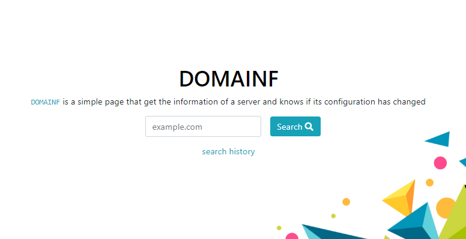
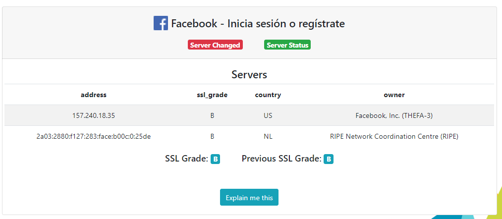
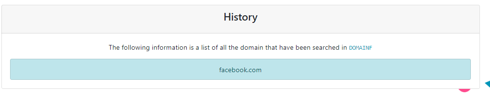

# Domainf  

Simple page that get the information of a server and knows if its configuration has changed.

### Search 

Write the domain you want to search like `facebook.com` and view the information that return:

* **Server Changed:** Is `green` if the information of the servers changed otherwise is `red`
* **Server Status:** Show with `green` if the server get some information and is working otherwise is `red`
* **Servers:** They are the servers of the input domain. Each server is show in a table with the following information:
    * **Address:** IP or host of the server
    * **SSL Grade:** The grade SSL grade given by [SSLabs](https://discussions.qualys.com/docs/DOC-6321-ssl-labs-grading-2018)
    * **Country:** The country where the server is
    * **Owner:** The owner of the server
* **SSL Grade:** The lower grade of all the domain servers
* **Previous SSL Grade:** The lower grade that the domain had before

### History
Click `search history` link to get a list with all hosts that have been searched

